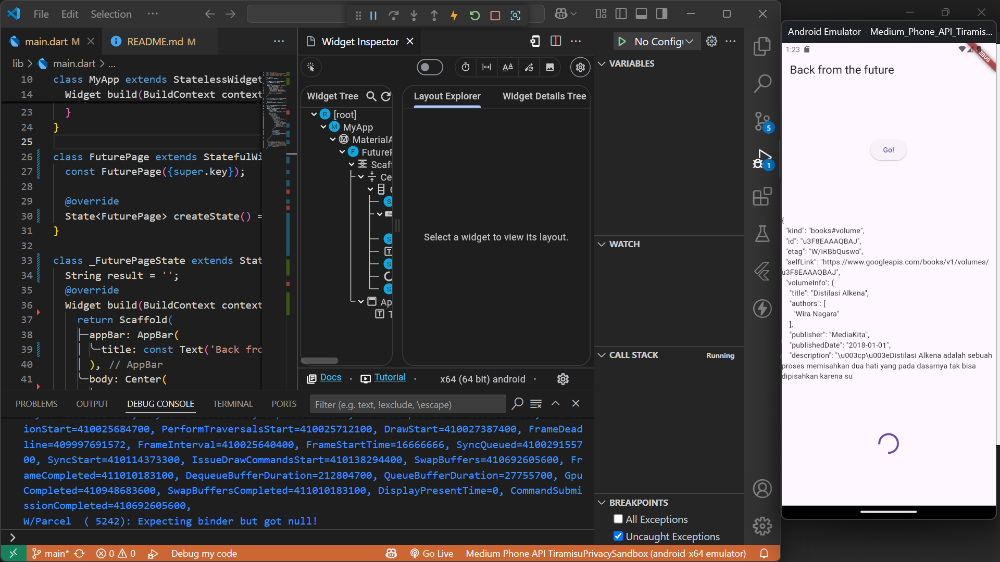
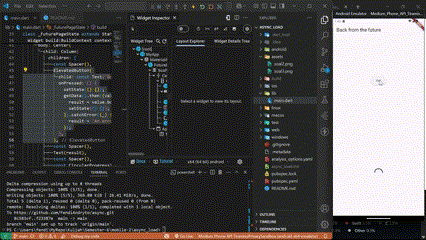
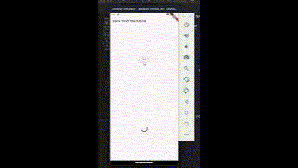
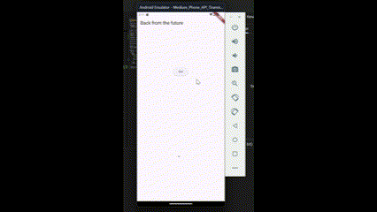

# async_load

## W5: Soal 2

## W5: Soal 3

### Penjelasan Langkah 5

- `substring(0, 450)` digunakan untuk memotong dan menyimpan hanya 450 karakter pertama dari respons yang diterima.
- `catchError` digunakan untuk menangani kemungkinan error dalam proses asynchronous dan memberikan pesan kesalahan yang dapat ditampilkan kepada pengguna.

## W5: Soal 4

### Penjelasan Langkah 1 & 2

- Fungsi `count()` menghitung jumlah total dari tiga nilai (1, 2, dan 3), masing-masing diproses dengan penundaan 3 detik menggunakan Future.delayed().
- Fungsi `async()` dipanggil secara berurutan, menunggu satu sama lain untuk menyelesaikan, dan akhirnya memperbarui UI dengan hasil yang dihitung.

## W5: Soal 5

### Penjelasan Langkah 2

- `Completer` digunakan untuk menyelesaikan `Future` secara manual setelah operasi `async` selesai.
- `getNumber()` mengembalikan `Future<int>` yang menyelesaikan dengan `nilai 42` setelah penundaan `5 detik.`
- `calculate()` melakukan penundaan selama `5 detik` dan kemudian menyelesaikan `Future` dengan `nilai 42.`

