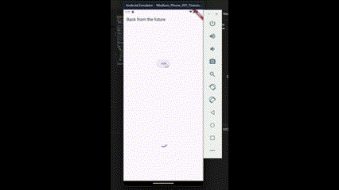

# async_load

## W5: Soal 2

## W5: Soal 3

### Penjelasan Langkah 5

- `substring(0, 450)` digunakan untuk memotong dan menyimpan hanya 450 karakter pertama dari respons yang diterima.
- `catchError` digunakan untuk menangani kemungkinan error dalam proses asynchronous dan memberikan pesan kesalahan yang dapat ditampilkan kepada pengguna.

## W5: Soal 4

### Penjelasan Langkah 1 & 2

- Fungsi `count()` menghitung jumlah total dari tiga nilai (1, 2, dan 3), masing-masing diproses dengan penundaan 3 detik menggunakan Future.delayed().
- Fungsi `async()` dipanggil secara berurutan, menunggu satu sama lain untuk menyelesaikan, dan akhirnya memperbarui UI dengan hasil yang dihitung.

## W5: Soal 5

### Penjelasan Langkah 2

- `Completer` digunakan untuk menyelesaikan `Future` secara manual setelah operasi `async` selesai.
- `getNumber()` mengembalikan `Future<int>` yang menyelesaikan dengan `nilai 42` setelah penundaan `5 detik.`
- `calculate()` melakukan penundaan selama `5 detik` dan kemudian menyelesaikan `Future` dengan `nilai 42.`

## W5: Soal 6

### Penjelasan Perbedaan Langkah 2 dan Langkah 5-6

- Langkah 2 adalah implementasi sederhana menggunakan `Completer` untuk menyelesaikan `Future` secara manual tanpa penanganan error eksplisit.
- Langkah 5-6 memperkenalkan penanganan error menggunakan `try-catch` dan menggunakan `.then()` dan `.catchError()` untuk menangani hasil dan error secara lebih komprehensif. Ini memberikan lebih banyak kontrol terhadap alur eksekusi dan cara menangani kegagalan.

## W5: Soal 7

### Capture Hasil

## W5: Soal 8

### Penjelasan code langkah 1 dan langkah 4

- code `Langkah 1` lebih verbose dan menggunakan `FutureGroup` untuk mengelola beberapa Future secara manual.
- code `Langkah 4` menggunakan `Future.wait`, yang membuat kode lebih ringkas, sederhana, dan mudah dibaca, karena `Future.wait` menangani koleksi dan penyelesaian beberapa `Future` secara otomatis.

## W5: Soal 9

### Capture Hasil

## W5 Soal 10

### Penjelasan `handleError` dan `returnError`

- `returnError` Fungsi ini menyebabkan error dengan sengaja dan melemparkan exception setelah penundaan dua detik. Ia mengembalikan Future yang gagal.

- `handleError` Fungsi ini berusaha menangani error yang dilemparkan oleh returnError(). Ia menangkap error tersebut di dalam blok catch dan menampilkan hasilnya dengan cara yang aman, serta mengeksekusi kode apapun di dalam blok finally.
