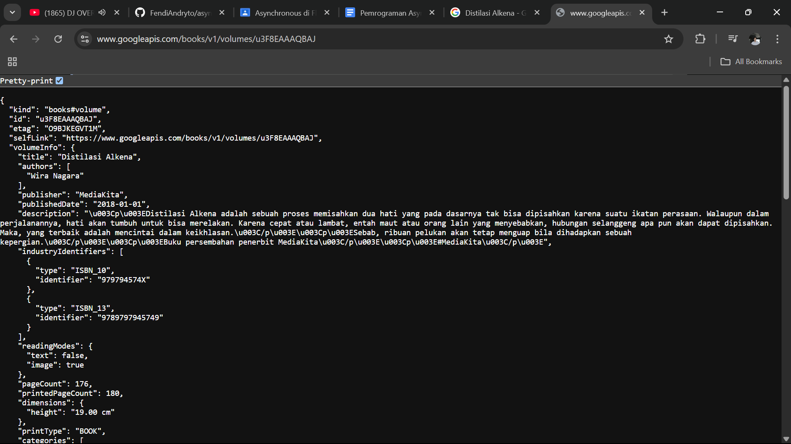

# async_load

## W5: Soal 2

## W5: Soal 3

### Penjelasan Langkah 5

- substring(0, 450) digunakan untuk memotong dan menyimpan hanya 450 karakter pertama dari respons yang diterima.
- catchError digunakan untuk menangani kemungkinan error dalam proses asynchronous dan memberikan pesan kesalahan yang dapat ditampilkan kepada pengguna.

